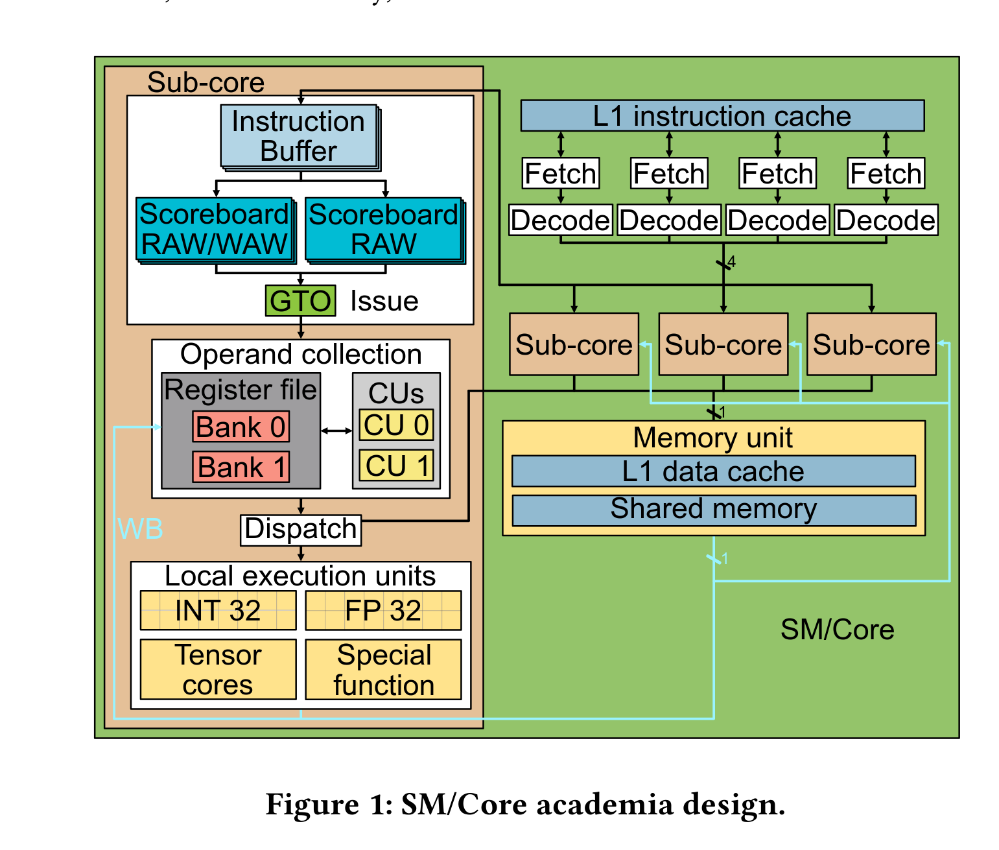
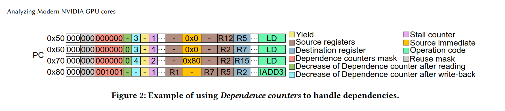
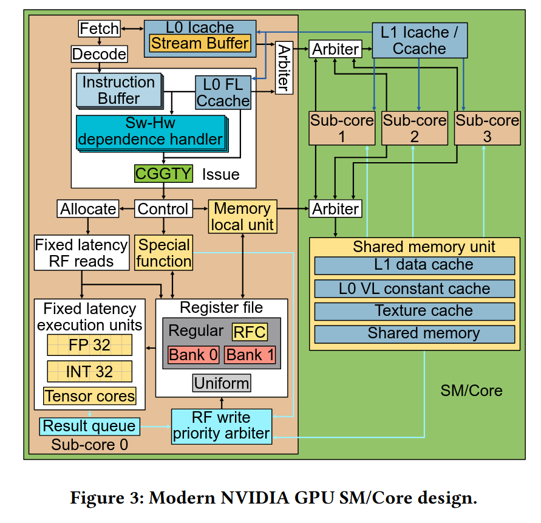

# Analyzing Modern NVIDIA GPU cores

Key terms: 
- **SASS**, NVIDIA assembly language, consists of 64 bit instructions. For instance `FFMA R1, R2, R3, R4` does `R1 = R2 * R3 + R4`
- **Control bits**, these modify how SASS is run - for instance by adding `@P0` in front `FFMA`, indicates that instruction only executes if `P0` register is True.
- **Issue logic**, how processor decides which instructions get executed *now*.
- **Register file**, fast storage used for scalar variables and small data. 
- **Register file cache**, cache for helping register file.
- **Memory pipeline**, sequence of steps for getting data from silicon to HBM.
- **Write-after-read hazard** occurs when instructions are executed out-of-order:
  * READ  R1 // Read (slow, so processor jumps to next)
  * WRITE R1 // Write *before* above is done
- **Collector Unit (CU)**: A hardware unit where issued instructions wait until all their required input data (source operands) are available.

- **Source register operands**: The data values stored in registers that an instruction needs to perform its operation.

- **Private register file**: Each sub-core has its own dedicated set of registers, not shared with other sub-cores.

- **Bank (of register file)**: The register file is divided into smaller sections called banks, allowing multiple simultaneous accesses.

- **Port (per bank)**: Each bank has one or more ports, which are access points that allow reading or writing data in a single cycle.

- **Arbiter**: A hardware component that manages conflicts when multiple instructions try to access the same register bank at the same time.

- **Dispatch stage**: The phase where an instruction is sent to the appropriate execution unit for processing.

- **Execution unit**: Specialized hardware blocks that perform specific types of operations, such as memory access, arithmetic (single-precision), or special functions.
- **Latency**: The amount of time it takes for an instruction to be processed by an execution unit.
- **Write-back stage**: The final phase where the result of an instruction is written back into the register file.



## Reverse Engineering Methodology

Write microbenchmarks - a few hand-written SASS instructions and a cycle measurement around them. For example:

```ass
CLOCK
NOP
FFMA R11 , R10 , R12 , R14
FFMA R13 , R16 , R_X , R_Y
NOP
CLOCK
```

Here, if R_X and R_Y are odd, 5 cycles pass. If R_X is even, and R_Y is odd, 6 cycles pass. If both R_X and R_Y is even, then 7 cycles pass.

NVIDIA doesn't (in 2025) support any official tools for writing SASS. Instead, open source CUAssembler is used.

SASS looks like this:



The above shows a sequence of
four instructions (three loads and one addition) with its associated
encoding the addition has dependencies with the loads (variable-
latency instructions), Dependence counters are used to prevent data
hazards.

The authors updated their view of the modern SM design to the following:



Compiler Guided Greedy
Then Youngest (CGGTY) is a scheduler policy. This is how warps in single thread block are selected. 