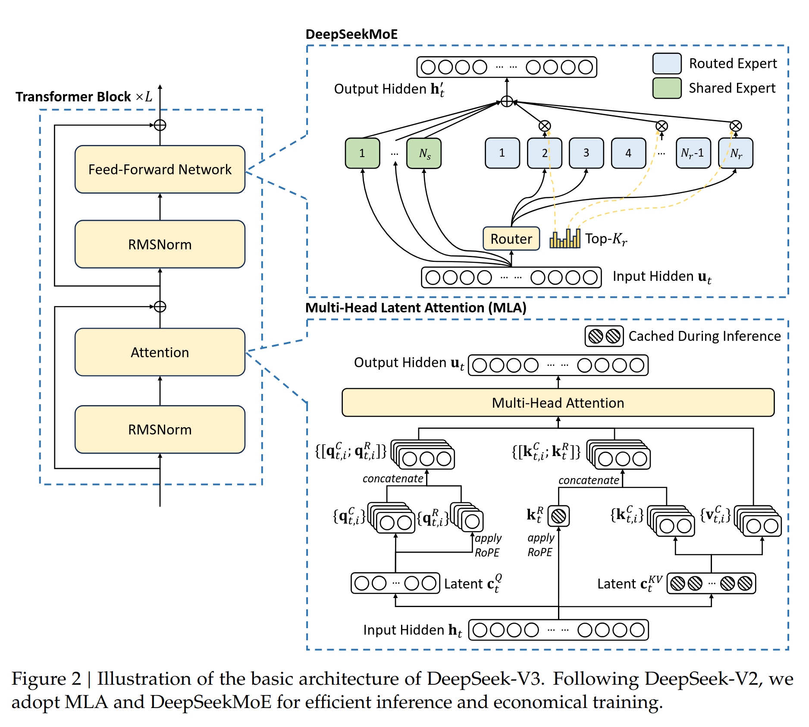

# DeepSeek-V3 Technical Report

DeepSeek-V3. Mixture of Experts (MoE) model, with 671B total, per-token 37B activated params. DeepSeek-V3 uses Multi-head Latent attention, and DeepSeekMoE, and auxiliarly-loss-free strat for load balancing. Training objective is multi-token prediction. Training corpus has 14.8T tokens. This work needed 2.788M H800 GPU hours and was stable. Weigths are open-source.

# Introduction

- **Tensor parallelism** is ... . 
- **Pipeline parallelism** is ... .

The main kicker to getting price down to 5.5Mil is the hardware-software co-design.

**Architecture**: new load balancing strategy and training objective:
- Auxiliary-loss-free strategy that minimizes performance degradation.
- Multi-token prediction objective -- can also be used for speculative decoding.

**Pre-training**: Efficiency innovations:
- FP8 mixed precision training framework. 
- With co-design of algo, framework, and hardware, communication bottleneck is solved (?)

# Architecture

DeepSeek-V3 has multi-head latent attention (MLA), for inference, and DeepSeekMoE for economical training. Non-mentioned settings come from DeepSeek-V2.

Basic architecture is still a Vaswani et al transformer, but with modifications:

