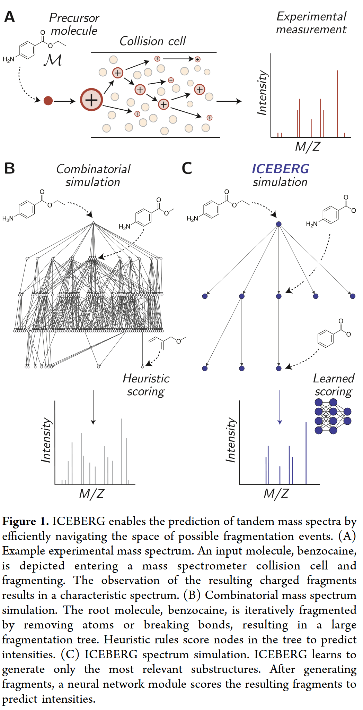

# Abstract

This is about predicting spectra from structure.

ICEBERG is about a physically-grounded neural network approach. 

1. Generate N fragmentations
2. Score each fragmentation, yielding fragment intensities too

# Methods

## Data sets

NIST20, how extraction happens is another study.

First, to normalize:
1. Merge all scans at various collision energies
2. Combine peaks within 1e-4 m/z
3. Renormalize merged by dividing by max
4. Take square root of each intensity (?)
5. Keep only top 50 peaks, at least 0.003 intens.

Next, to normalize spectra:
1. Subtract adduct ion from each peak m/z, allowing all adduct types to work 
2. All peaks are singly charged (assumption)
3. All peaks use mass and m/z interchangeably

## Canonical DAG construction

Directed acyclic graph is built for each spectrum. This is a fragmentation graph M.

MAGMa iteratively removes atoms from molecule to make a DAG. 

Once M is complete, a subset of fragments is used to explain each peak in Y, using mass differences of 20 ppm.

Fragments that are selected, cause the selection of all nodes from that fragment to root. To prune DAG bottom-up, a subset of parent nodes are greedily selected to cover most fragments.

Neutral loss fragments are also added to DAG.

## Models

ICEBERG has two parts. First is SMILES to fragment candidates. Second is fragment candidates to intensities.

To predict binary probas of fragmentation of each atom, 

Use shallow MLP with binary simgoid with inputs of concatenated:
1. GNN(M)
2. GNN(M) - GNN(Si)
3. GNN(Si)j
4. Onehot(b)
5. Enc(f)
6. Enc(f0 - fi)

Train to maximize the probability of generating the DAG, with BCE loss over each atom for every fragment in observed spectrum.

To predict (score) intensities of each fragment, 

Featurize each individual fragment with a shallow MLP,
hi = MLP([GNN(M), GNN(M) - GNN(Si), GNN(Si), Onehot(b), Enc(f), Enc(f0-fi)])

Embed these hi into a transformer and predict unnormalized intensity weights at each possible hydrogen shift delta. 

....

Structure -> Compbinatorial simulation (?) -> Neural network scores fragments -> MS/MS spectrum

