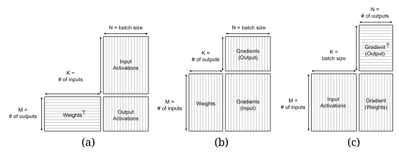
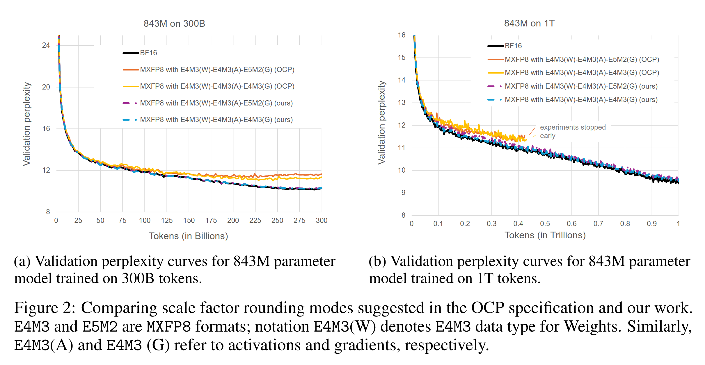
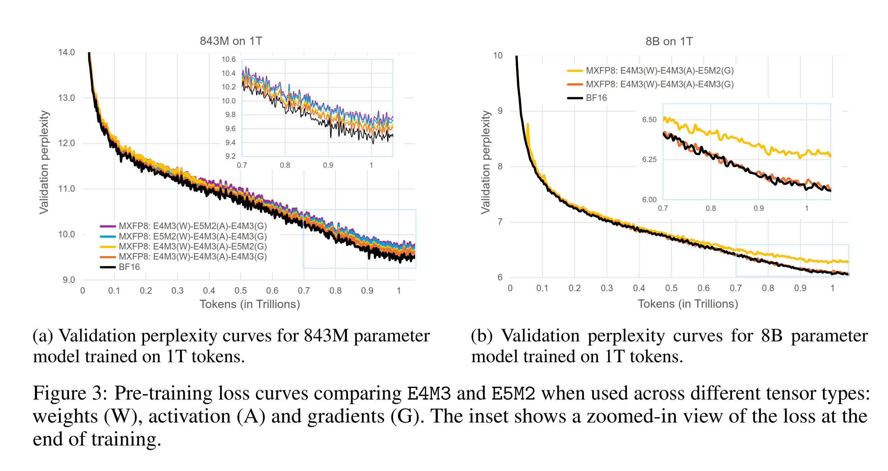
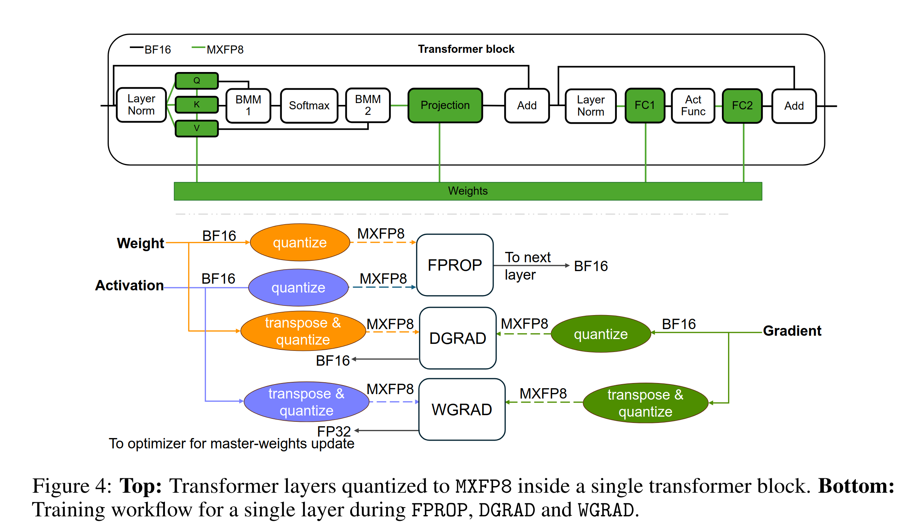

Microscaling (MX)

MX is about using 8,4, and smaller data types and per-block scaling factors to cram more compute in GPUs.

MX is still tricky, but more stable than fp8.

This paper proposes new rounding scheme that is improved on Open Compute Project (OCP) [?]. 

They use "round-to-infinity" [Is this just round up?].

They show this rounding works for some 8B model over 15T token dataset. 

# Intro

See Figure 1.

Scaling blocks: Goal here is to fit all weights in smaller memory space. Basic idea is you have this 2D matrix of network weights. You take a row of this matrix. Calculate the mean value and up to 32 outliers (really large numbers). Then, you take the mean value and subtract it from each - and you also store the 32 outliers. What remains is then compressed into fp8, or fp8 even, plus the 32 fine-grained numbers. 

Question--how large should each row be--is still open.

OCP et al showed that scaling blocks can be large - they argue it's best if blocks are kept smaller. 

Blackwell natively supports MXFP8, 6 and 4 data types. The E4M3 is an MXFP8 datatype. E4M3 means 8 bits per float - 1 is sign, 4 is exponent and 3 mantissa. 

Contributions:
1. Compare different MXFP types
2. Show that LLM that is mostly MXFP8, except start and end, matches BFP16 LLM.

# Microscaling

Block size (K) for scaling is 32. Scaling factor (X) is single 8bit value that encodes all power of two values from `2**-127` to `2**127`. So it has, `2**0`, `2**1`, `2**-1` and so on. It also has NaN. 

They feed 2 blocks of K Quantized values and X factors to tensor cores. Tensor cores dequantize, perform dot product and accumulate results back into FP32.
Tensor cores are idle most time - this is a well known problem. This quant-dequant can keep TCs usefully busy, and making better use of memory bandwidth.

# Pretraining with MXFP8

**Recall that** each linear layer in NN, recall that we have 3 operations:



Figure 2. Dimensions of equivalent GEMMs for (a) forward propagation, (b) activation gradient, and (c) weight gradient computations of a fully-connected layer.

All these are quantized from FP32 to MXFP8. MXFP8 is read, stored and operated on by hardware. 

Specifically, this work trains 
- E4M3 (W), E4M3(A), E5M2(G) and
- E4M3 (W), E4M3(A), E4M3(G)
networks. Where W, A and G denote weights, Activations and Gradients.

These are the training losses they get:



Clearly they beat OCP.

## From FP32 to MXFP8

Quantization is same for all formats (E4M3, E2M1, etc ...).

OCP says (and this is what they improved):

```py
# Calcualate X, given V
amax = max(abs(V))    # Largest in this 32 list
destmax = max(abs(E4M3)) # Largest number representable
X = floor(log2(amax)) / floor(log2( destmax ))
```

They replaced this with:

```py
# Calculate X, given V
amax = max(abs(V))
destmax = max(abs(E4M3))
Xfloat = amax/destmax

expXfloat = log2(Xfloat) # Extract exponent of X
expXint = ceil(expXfloat) # round up
X = clamp(expXint, -127, 127) # clamp to E8M0
X = X + 127 # add bias
return X
```

So, the main idea, instead of

```py
X = floor(log2(amax)) / floor(log2(destmax))
```

we now have

```py
X = 127 + clamp( ceil( log2( amax/destmax ) ), -127, +127)
```

that is then shown to perform nearly like a BF16.

They also argue that all three W,A,G in E4M3 is better than having WA in E4M3 and G in E5M3. Essentially, they get a near-perfectly BF16 performance, by using E4M3 for all three tensors!



Given that MX formats are 2x smaller than BF16, this should be substantially faster!

Interestigly, smaller models (850M) are a bit worse than larger (8B) with either MX methods.

**Which layers to MXFP8-fy?**. Quantize QKV, PROJ, FFN Up and Down, in all blocks. DO NOT Quantize QK product, and DO NOT quantize Score Value product. Also, Softmax, Act-func, and residual-add are also in Hi-prec. Finally Input embedding and output projection are also in BF16.



Downside - two copies of each tensor (W,A,G) are needed. One for quantization, other for transposed quantization. This is needed, because each tensor (W,A,G) is used in non-transposed and transposed forms in matmuls.

- FPROP = `A  = W.T @ X`,   `BF16 = FP8.T @ FP8`
- DGRAD = `Ga = W   @ G`,   `BF16 = FP8.T @ FP8`
- WGRAD = `Gw = A.T @ G.T`  `BF16 = FP8.T @ FP8.T`

**MXFP8 vs FP8**. They find FP8 is equivalent in accuracy to MXFP8. 

**MXFP8 vs blockwise-FP8**. MXFP8 is easier because logic of quant-dequant is handled at hardware.

MXFP8 is 2x faster on GB200 Blackwell, because tensor cores can handle it. Otherwise there's no good way to use them. Another downside is that not all layers can equally use MXFP8, and have to be performed in BF16. 


# Appendix

## UE8M0 rounding

FP32 number is represented as bit pattern of S,E,M, and means 2^E * 1.M (normal) and 2^{-126} * 0.M (denormal). 


## Why special hardware

GEMM operations consist of dot products, and dot products need to process scale factors, per each block *pair*. This is expensive, and hardware can do it faster.

